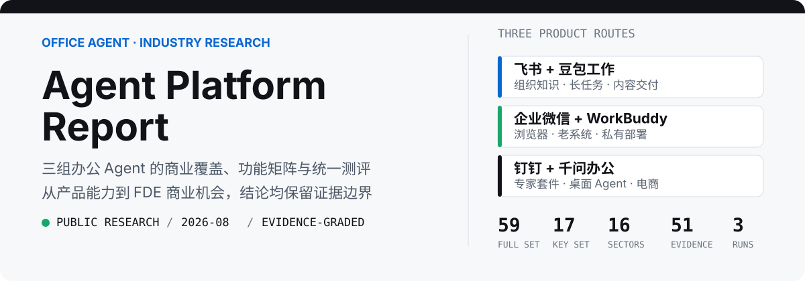
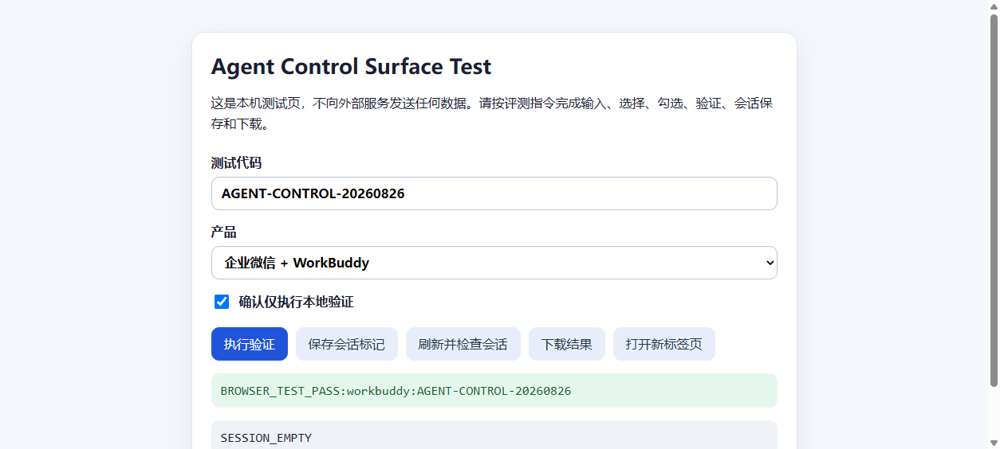
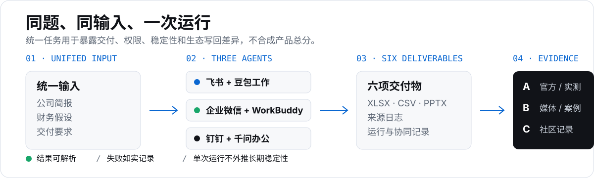

<p align="center">
  
</p>

<p align="center">
  <a href="https://wishyouerehere9610.github.io/agent-platform-report/"><strong>在线报告</strong></a>
  · <a href="./benchmark/deliverable-spec.md">统一测评命题</a>
  · <a href="./office-agent-report/evidence/methodology.md">证据口径</a>
  · <a href="./office-agent-report/data/">结构化数据</a>
</p>

## 这个仓库回答什么

Agent Platform Report 是一份面向业务同学、FDE 和办公 Agent 产品研究者的开源横向研究。项目比较三组产品组合：

- 飞书 + 豆包工作
- 企业微信 + WorkBuddy
- 钉钉 + 千问办公

研究不只记录产品是否声明支持某项功能，还检查实际交付物、运行环境、授权阻塞、返工量和结果写回。公开能力与本次实测分别记录，一次运行结果不会被外推成长期稳定性。

## 你会看到什么

| 模块 | 研究内容 | 主要证明 |
| --- | --- | --- |
| 产品商业覆盖 | 产品定位、发布状态和行业证据 | 16 个行业的分级记录 |
| 功能矩阵 | 产品形态、任务执行、办公交付和企业能力 | 59 项完整数据，页面展示 17 项关键能力 |
| 任务交付测试 | 同一公司简报、财务假设和交付要求 | 3 次单次运行、3 项业务交付物和 3 份轨迹资料 |
| Browser / Computer Use | 公开能力路线与本机最小操控测试 | 表单、桌面保存、权限和工具入口记录 |
| FDE 商业机会 | 标准流程、老系统自动化和执行治理 | 买方、交付内容、验收条件和证据边界 |

## 真实证据

下面是 WorkBuddy 完成本地浏览器表单测试后的证据截图。它只证明这一次测试中的输入、选择、勾选、点击和结果读取，不代表所有网页任务都能稳定完成。

<p align="center">
  
</p>

更多原始记录见 [`outputs/control-surface-tests/`](./outputs/control-surface-tests/) 和 [`sessions/`](./sessions/README.md)。

## 统一测评怎么做

<p align="center">
  
</p>

统一命题要求 Agent 为虚构公司 FieldPilot AI 制定 FDE 商业化方案：从 6 个候选行业中选择 2 个优先行业，形成目标企业清单、试点服务包、定价与毛利模型和 90 天 GTM。

三款产品读取相同输入，每款只运行一次。单次运行最多 45 分钟，权限、登录、工具和生态动作失败时必须如实记录。

- **飞书 + 豆包工作：** `Auto 高`，3/3 业务文件完成。飞书个人空间动作完成；GUI 最小测试受录制授权阻塞。
- **企业微信 + WorkBuddy：** `Auto`，3/3 业务文件完成。浏览器最小测试完成；企业微信动作未完成，飞书替代通道不计入成绩。
- **钉钉 + 千问办公：** `基础模式`，3/3 业务文件完成。浏览器测试完成；桌面输入后保存失焦，钉钉 OAuth 阻塞。

业务交付物包括行业优先级工作簿、目标企业 CSV 和管理层 PPTX。运行轨迹、来源日志和协同测试日志用于解释这些文件是如何产生的，以及过程中发生了什么。

## 本地查看

```bash
git clone https://github.com/Wishyouerehere9610/agent-platform-report.git
cd agent-platform-report
npm run check
python3 -m http.server 4173
```

打开 `http://127.0.0.1:4173/` 查看报告。`npm run check` 会重新生成浏览器数据，并运行数据与页面契约测试。

## 仓库结构

| 路径 | 内容 |
| --- | --- |
| [`benchmark/`](./benchmark/) | 公司背景、财务假设、统一 Prompt 和评分规则 |
| [`outputs/`](./outputs/) | 三款 Agent 生成的 XLSX、CSV、PPTX、来源和运行日志 |
| [`sessions/`](./sessions/README.md) | 从本机提取并脱敏的任务级会话与运行证据 |
| [`office-agent-report/data/`](./office-agent-report/data/) | 功能、行业、证据、运行和呈现层结构化数据 |
| [`office-agent-report/evidence/`](./office-agent-report/evidence/) | 方法、结论边界和控制界面分析 |
| [`index.html`](./index.html) | GitHub Pages 呈现层入口 |
| [`scripts/`](./scripts/) | 报告数据和基准输入构建脚本 |

## 证据边界

- 每款产品只运行一次，不计算长期成功率，也不合成产品总分。
- 官方支持、本地实测、媒体案例和社区记录使用不同证据等级。
- WorkBuddy 的飞书 4/4 是替代通信通道结果，不计入企业微信成绩。
- 测试中的公司和商业目标均为虚构输入，不代表真实客户、合同或采购意向。
- 文本日志中的账号姓名、平台 ID、OAuth 回调、令牌和本机用户路径已经脱敏。
- 授权二维码、Cookie、浏览器缓存、应用账号数据库和其他认证材料没有上传。

安全问题与披露方式见 [`SECURITY.md`](./SECURITY.md)。

## License

[MIT](./LICENSE)
